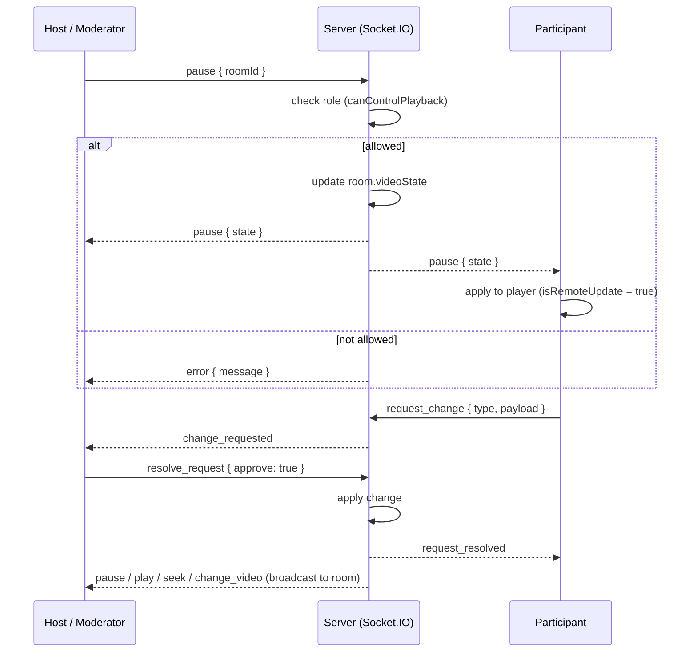

# 🎬 YouTube Watch Party (loop.)

Watch YouTube videos together in real time. Create a room, share the code or invite link, and everyone in the room sees the same video state: play, pause, seek position and current video. Access is controlled by roles (Host, Moderator, Participant) that are **enforced on the server**.

Built as the Web3task intern assignment.

## 🔗 Live Demo

| | URL |
|---|---|
| **Live app (Frontend, Vercel)** | https://yt-watch-party-flax.vercel.app |
| **Backend (Render)** | https://yt-watch-party-gtk9.onrender.com |
| **Source code** | https://github.com/Sagun-Bajpai/yt-watch-party |
| **Demo video** | _Add your video link here_ |


### 📸 Screenshots

| Lobby | Host view | Participant view |
|---|---|---|
|  |  |  |
---

## ✨ Features

**Core (from the assignment)**
- Create a room (the creator automatically becomes **Host**)
- Join an existing room with a room code or an invite link (joiner becomes **Participant**)
- Participant list that shows every user's role, updated live
- Real-time sync of **play / pause**, **seek** and **change video** for everyone in the room
- **Role-based access control**, validated on the backend before any event is processed
- Host can **assign roles** (Participant ⇄ Moderator), **remove participants** and **transfer host**
- **Request-approval flow:** a Participant cannot change playback directly. They send a request, and a Host or Moderator approves or rejects it

**Bonus**
- Real-time **chat** (300-character limit, last 50 messages kept, new joiners receive recent history)
- **Copy Invite Link** (`/?room=CODE` pre-fills the room code)
- **OOP-structured** backend (`User`, `Room`, `RoomManager` classes)
- Server-side handling of disconnects, leaving, duplicate joins and host succession

---

## 🧰 Tech Stack

| Layer | Technology | Why |
|---|---|---|
| Frontend | React + Vite + Tailwind CSS | Fast setup, component-based UI |
| Backend | Node.js + Express | Simple HTTP server and health check |
| Realtime | **Socket.IO** (WebSockets) | Built-in rooms, reconnection and broadcasting |
| Video | YouTube IFrame Player API (`react-youtube`) | Embedded and controllable player |
| Storage | In-memory (`Map`) | Enough for an MVP; see trade-offs |
| Deployment | Vercel (frontend), Render (backend) | Free tiers, WebSocket support on Render |

---

## 🏗️ Architecture Overview

The browser connects to the server over a persistent WebSocket connection (Socket.IO). The server is the **single source of truth**: it keeps every room's state in memory, validates each event against the sender's role, updates the state and broadcasts the result to everyone in the room.



### Backend structure

```
server/
  models/
    User.js            # id, socketId, username, role
    Room.js            # participants Map, videoState, role rules
  RoomManager.js       # Map<roomId, Room>, room code generation, cleanup
  socket/
    roomHandler.js     # all Socket.IO event handlers + permission checks
  server.js            # Express + Socket.IO setup, CORS, /health
  socketTest.js        # integration test that talks to a running server
client/
  src/
    App.jsx            # lobby, room view, participants, chat, requests
    Player.jsx         # YouTube player + sync logic
```

- **`Room`** encapsulates room logic: adding and removing users, role rules (`canControlPlayback`, `assignRole`, `removeByHost`, `transferHost`) and the current video state. If the host leaves, the oldest Moderator (else the oldest Participant) becomes the new Host.
- **`RoomManager`** stores all active rooms and deletes empty ones.
- **`roomHandler`** is a thin layer that validates input, calls the `Room` methods and broadcasts.

---

## 🔐 Roles and Permissions

| Action | Host | Moderator | Participant |
|---|:---:|:---:|:---:|
| Watch video and chat | ✅ | ✅ | ✅ |
| Play / pause / seek | ✅ | ✅ | ❌ (can request) |
| Change video | ✅ | ✅ | ❌ (can request) |
| Approve / reject requests | ✅ | ✅ | ❌ |
| Assign roles | ✅ | ❌ | ❌ |
| Remove participants | ✅ | ❌ | ❌ |
| Transfer host | ✅ | ❌ | ❌ |

**How enforcement works:** every control event first passes `assertCanControl` (Host or Moderator) and every management event passes `assertIsHost`. `Room` methods check the role **again** (defense in depth). Hiding buttons in the UI is only a convenience; a Participant who emits events from the browser console is rejected by the server with an `error` event.

---

## 📡 WebSocket Events

**Client → Server**

| Event | Payload | Who can send | Description |
|---|---|---|---|
| `create_room` | `{ username }` | Anyone | Create a room, creator becomes Host |
| `join_room` | `{ roomId, username }` | Anyone | Join an existing room as Participant |
| `leave_room` | `{ roomId }` | Member | Leave the room |
| `play` | `{ roomId, currentTime }` | Host, Moderator | Start playback |
| `pause` | `{ roomId }` | Host, Moderator | Pause playback |
| `seek` | `{ roomId, currentTime }` | Host, Moderator | Jump to a time |
| `change_video` | `{ roomId, videoId }` | Host, Moderator | Load a new video |
| `assign_role` | `{ roomId, targetId, newRole }` | Host | Set Moderator or Participant |
| `remove_participant` | `{ roomId, targetId }` | Host | Remove a user |
| `transfer_host` | `{ roomId, targetId }` | Host | Make another user the Host |
| `send_message` | `{ roomId, text }` | Member | Send a chat message |
| `request_change` | `{ roomId, type, payload }` | Participant | Ask for play / pause / seek / change_video |
| `resolve_request` | `{ roomId, requestId, approve }` | Host, Moderator | Approve or reject a request |

**Server → Client**

| Event | Description |
|---|---|
| `room_created` | Sent to the creator with the room code |
| `sync_state` | Sent once to a new joiner with the current video state and participants |
| `play`, `pause`, `seek`, `change_video` | Broadcast to the room after a permitted change |
| `user_joined`, `user_left` | Participant list update |
| `role_assigned` | Role change, includes the updated participant list |
| `participant_removed` | A participant was removed |
| `removed_from_room` | Sent to the removed user so the UI returns to the lobby |
| `new_message` | A chat message was broadcast |
| `change_requested`, `request_sent`, `request_resolved` | Request-approval flow |
| `error` | Sent only to the sender when an action is rejected |

---

## 🔁 Sync Logic and Challenges Solved

### 1. The sync loop bug
**Problem:** The Host pauses → the server tells everyone to pause → the Participant's player pauses → its `onStateChange` fires → the client could send `pause` back to the server → an infinite loop.

**Solution:** An `isRemoteUpdate` ref. Before applying a command that came from the server, it is set to `true` and the player's own events are ignored. It is reset after a short delay. Participants also have no playback controls, and the server would reject their events anyway.

### 2. Drift control
Network latency and buffering make players differ by a second or two. The client only calls `seekTo()` when the difference to the server time is **more than 2 seconds**. Seeking on every small difference would cause constant buffering glitches.

### 3. Detecting a seek
The YouTube IFrame API has no seek event. The player checks `getCurrentTime()` periodically while playing and treats a sudden jump as a seek.

### 4. Late joiners
The server computes the live position (`currentTime` plus the time elapsed since the last update when playing) and sends it in `sync_state`, so a new user starts at the right moment.

### 5. Disconnects and host succession
`disconnect` and `leave_room` remove the user from the room. If the Host leaves, a new Host is promoted automatically. Empty rooms are deleted.

---

## 🚀 Run Locally

**Prerequisites:** Node.js 18+ and npm.

```bash
git clone https://github.com/Sagun-Bajpai/yt-watch-party.git
cd yt-watch-party
```

**1. Backend**
```bash
cd server
npm install
cp .env.example .env      # Windows: copy .env.example .env
npm run dev               # or: npm start   (runs on http://localhost:5000)
```

**2. Frontend** (new terminal)
```bash
cd client
npm install
echo VITE_SERVER_URL=http://localhost:5000 > .env
npm run dev               # runs on http://localhost:5173
```

**3. Try it:** open `http://localhost:5173` in a normal window (create a room) and in an incognito window (join with the code). Check `http://localhost:5000/health` to confirm the server is running.

**4. Optional integration test** (server must be running):
```bash
cd server
node socketTest.js
```
It checks that a Participant is rejected for `play`, `change_video` and `assign_role`, that a promoted Moderator can control playback, and the chat and removal flows.

### Environment variables

| Variable | Where | Example | Purpose |
|---|---|---|---|
| `PORT` | server | `5000` | Server port (Render sets this automatically) |
| `CLIENT_URL` | server | `https://yt-watch-party-flax.vercel.app` | Allowed frontend origin for CORS. No trailing slash |
| `VITE_SERVER_URL` | client | `https://yt-watch-party-gtk9.onrender.com` | Backend URL used by Socket.IO. No trailing slash |

---

## ☁️ Deployment

- **Backend → Render** (Web Service): Root Directory `server`, Build `npm install`, Start `npm start`, env var `CLIENT_URL`.
- **Frontend → Vercel**: Root Directory `client` (Vite is detected automatically), env var `VITE_SERVER_URL`.
- Vite reads environment variables at **build time**, so the frontend must be **redeployed** after changing `VITE_SERVER_URL`.
- Free tier note: Render spins down idle services, which delays the first request.

---

## ⚖️ Trade-offs and Known Limitations

| Decision | Reason | Limitation / Future fix |
|---|---|---|
| **In-memory room storage** | Fast and simple for an MVP | Rooms are lost when the server restarts. Fix: Redis or a database (persistent rooms) |
| **`socket.id` as user ID** | No login needed | A page refresh creates a new user who rejoins as Participant. Fix: authentication or a persistent session ID |
| **2-second drift tolerance** | Avoids buffering glitches | Players can differ by up to ~2 seconds |
| **Single server instance** | Simplicity | Fix: Socket.IO Redis adapter + load balancer for horizontal scaling |
| **Render free tier** | Free hosting | Cold start of up to ~50 seconds |

---

## 🔮 Future Improvements

- Authentication (login before joining) and persistent rooms stored in a database
- Horizontal scaling with the Socket.IO Redis adapter and Redis Pub/Sub
- Emoji reactions on key moments
- Automated unit tests for the `Room` class

---

## 👤 Author

**Sagun Bajpai** · [GitHub](https://github.com/Sagun-Bajpai)
